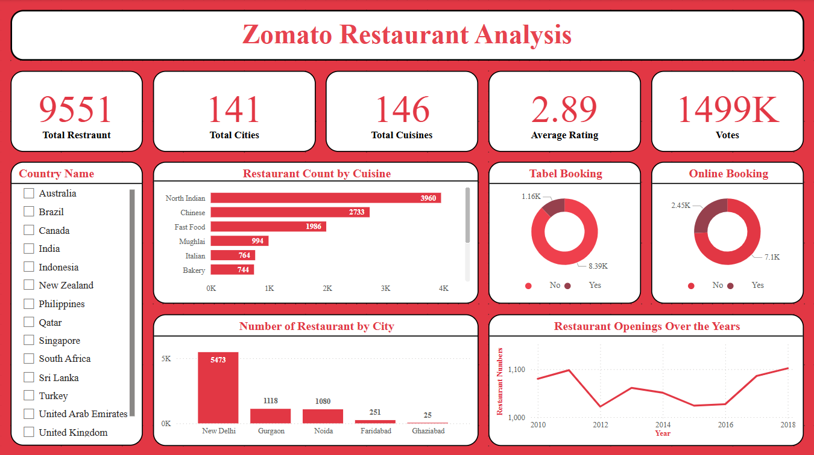

# 🍽️ Zomato Restaurant Analysis Dashboard (Power BI)

This Power BI dashboard provides an end-to-end analysis of restaurant data sourced from Zomato. The dashboard helps stakeholders, data analysts, and business users understand trends, patterns, and key metrics in the global restaurant landscape.

---
## 📷 Dashboard Preview

## 📊 Dashboard Overview

The dashboard includes the following high-level KPIs and visuals:

| Metric              | Description                                        |
|---------------------|----------------------------------------------------|
| 🏢 Total Restaurants | Total number of restaurants listed                |
| 🌆 Total Cities      | Count of unique cities with restaurant listings   |
| 🍽️ Total Cuisines    | Number of distinct cuisines offered               |
| ⭐ Average Rating    | Overall average user rating of restaurants        |
| 🗳️ Total Votes       | Sum of all user votes across restaurants          |

---

## 📈 Visuals Included

### 1. **Restaurant Count by Cuisine**
- Horizontal bar chart showing the number of restaurants by cuisine type.
- Highlights top cuisines like North Indian, Chinese, Fast Food, etc.

### 2. **Table Booking & Online Booking**
- Two donut charts showing how many restaurants support:
  - Table booking
  - Online delivery
- Segmented by Yes/No for quick insight

### 3. **Restaurant Count by City**
- Vertical bar chart displaying city-wise distribution.
- Reveals concentration in metro areas like New Delhi, Gurgaon, Noida.

### 4. **Restaurant Openings Over the Years**
- Line chart showing the number of new restaurant openings per year.
- Helps track growth and drop patterns over time.

### 5. **Country Filter Panel**
- Slicer enabling filtering of the dashboard by country.
- Allows focused exploration per region or geography.

---

## 🎨 Design Notes

- **Theme**: Custom Zomato branding using red (`#E23744`) and white contrast
- **Font**: Clean modern typography 
- **Layout**: KPI summary cards on top, followed by visual insights below
- **User Interaction**: Fully interactive with slicers and visual cross-filtering

---

## 🧠 Insights You Can Draw

- Most popular cuisines globally
- City-wise restaurant concentration
- Booking & delivery adoption rates
- Year-over-year growth in openings
- User engagement via ratings and votes

---

## 🚀 Tools Used

- **Power BI Desktop**
- **Power Query (M)**
- **DAX** (for measures and KPIs)
- **Custom JSON theme** for consistent colors and fonts

---

## 📁 File Details

| File Name                  | Description                    |
|----------------------------|--------------------------------|
| `Zomato_Dashboard.pbix`    | Main Power BI dashboard file   |
| `Zomato_Theme.json`        | Custom Power BI theme (colors + fonts)
| `README.md`                | This documentation file

---

## 📌 How to Use

1. Open the `.pbix` file in Power BI Desktop.
2. Explore using slicers (e.g., Country Name).
3. Interact with charts to view cross-filtered results.
4. Customize further using Power BI's editing features.

---

## 📝 Author

**Kirtikumar**  
Data Analyst | Power BI Developer  
📧 kkchittapur1928@gmail.com  
🌐 www.linkedin.com/in/kirtikumar-chittapur

---

## 📜 License

This project is for learning and portfolio purposes only. Not affiliated with Zomato.
